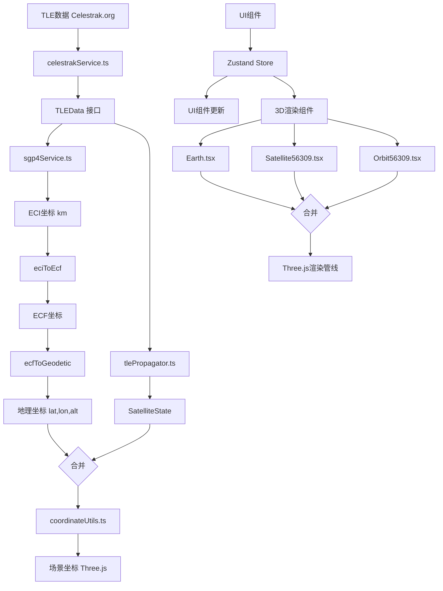

# 数据流图生成 Prompt

## 图表要求

请生成一个技术文档风格的数据流图，包含两个独立的流程图，展示卫星轨道可视化系统的数据输入处理流程和状态管理渲染流程。

## 第一部分：数据输入与处理流程

### 起始节点
- **节点1**: "TLE数据 (Celestrak.org)"
  - 类型：数据源（矩形框，顶部）
  - 说明：外部数据源，提供卫星轨道两行元素数据

### 数据获取层
- **节点2**: "celestrakService.ts"
  - 类型：服务模块（矩形框，带边框）
  - 内容：
    - 主标题：celestrakService.ts
    - 功能列表：
      - getTLEByNoradId()
      - getFamousSatellites()
      - 解析TLE格式
  - 连接：从节点1向下箭头指向节点2

### 数据接口层
- **节点3**: "TLEData 接口"
  - 类型：数据接口（圆角矩形）
  - 说明：标准化的TLE数据结构
  - 连接：从节点2向下箭头指向节点3

### 轨道传播层（分支）
从节点3分出两个并行分支：

**分支A - SGP4服务**:
- **节点4A**: "sgp4Service.ts"
  - 类型：服务模块（矩形框）
  - 内容：
    - createSatrec（创建卫星记录对象）
    - propagateECI（传播到ECI坐标）
  - 连接：从节点3向右下箭头指向节点4A

- **节点5A**: "ECI坐标 (km)"
  - 类型：数据节点（椭圆形）
  - 说明：地心惯性坐标系位置
  - 连接：从节点4A向下箭头指向节点5A

**分支B - 自定义传播器**:
- **节点4B**: "tlePropagator.ts (自定义传播器)"
  - 类型：服务模块（矩形框）
  - 内容：
    - propagateToTime（传播到指定时间）
  - 连接：从节点3向右下箭头指向节点4B

- **节点5B**: "SatelliteState"
  - 类型：数据节点（椭圆形）
  - 说明：卫星状态对象
  - 连接：从节点4B向下箭头指向节点5B

### 坐标转换链（从节点5A开始）
- **节点6**: "eciToEcf()"
  - 类型：转换函数（菱形框）
  - 说明：ECI转ECF坐标转换
  - 连接：从节点5A向右箭头指向节点6

- **节点7**: "ECF坐标"
  - 类型：数据节点（椭圆形）
  - 说明：地心地固坐标系
  - 连接：从节点6向下箭头指向节点7

- **节点8**: "ecfToGeodetic()"
  - 类型：转换函数（菱形框）
  - 说明：ECF转地理坐标转换
  - 连接：从节点7向下箭头指向节点8

- **节点9**: "地理坐标 (lat,lon,alt)"
  - 类型：数据节点（椭圆形）
  - 说明：纬度、经度、高度
  - 连接：从节点8向下箭头指向节点9

### 合并点
- **节点10**: 合并节点
  - 说明：节点5B和节点9在此合并
  - 连接：从节点5B和节点9分别用箭头指向节点10

### 场景坐标转换
- **节点11**: "coordinateUtils.ts"
  - 类型：工具模块（矩形框）
  - 内容：
    - latLonAltToScenePos()（地理坐标转场景坐标）
  - 连接：从节点10向下箭头指向节点11

- **节点12**: "场景坐标 (Three.js)"
  - 类型：最终数据节点（椭圆形，加粗边框）
  - 说明：Three.js 3D场景坐标系
  - 连接：从节点11向下箭头指向节点12

## 第二部分：状态管理与渲染流程

### 起始节点
- **节点13**: "UI组件 (TimeControlPanel, SatelliteInfoPanel)"
  - 类型：用户界面层（矩形框，浅色背景）
  - 内容：
    - 用户交互 → 调用 appStore 方法
  - 说明：用户操作触发状态更新

### 状态管理层
- **节点14**: "Zustand Store (appStore.ts)"
  - 类型：状态管理（矩形框，带边框，居中）
  - 内容：
    - 主标题：Zustand Store (appStore.ts)
    - 方法列表：
      - setTimeSpeed()
      - setSelectedSatellite
      - setFocusedSatellite
      - getCurrentEffectiveTime()
  - 连接：从节点13向下箭头指向节点14

### 分支渲染层
从节点14分出两个并行分支：

**分支C - UI更新**:
- **节点15C**: "UI组件更新 (React状态)"
  - 类型：UI层（矩形框）
  - 说明：React组件状态响应式更新
  - 连接：从节点14向左下箭头指向节点15C

**分支D - 3D渲染**:
- **节点15D**: "3D渲染组件 (useFrame钩子)"
  - 类型：渲染层（矩形框）
  - 说明：React Three Fiber渲染循环
  - 连接：从节点14向右下箭头指向节点15D

### 3D组件详细分支（从节点15D开始）
从节点15D分出三个并行子分支：

- **节点16A**: "Earth.tsx"
  - 类型：组件模块（矩形框）
  - 内容：
    - 自转（地球旋转计算）
    - 光照（太阳光照方向）
    - Shader（晨昏线着色器）
  - 连接：从节点15D向下箭头，然后分叉指向节点16A

- **节点16B**: "Satellite56309.tsx"
  - 类型：组件模块（矩形框）
  - 内容：
    - 传播（轨道传播计算）
    - 坐标转换（ECI到场景坐标）
    - 遮挡检测（地球遮挡判断）
  - 连接：从节点15D向下箭头，然后分叉指向节点16B

- **节点16C**: "Orbit56309.tsx"
  - 类型：组件模块（矩形框）
  - 内容：
    - 轨道点（生成轨道点集）
    - 曲线（CatmullRom曲线平滑）
    - 渲染（轨道线渲染）
  - 连接：从节点15D向下箭头，然后分叉指向节点16C

### 合并与最终渲染
- **节点17**: 合并节点
  - 说明：节点16A、16B、16C在此合并
  - 连接：从三个组件节点分别用箭头指向节点17

- **节点18**: "Three.js渲染管线 (GPU加速渲染)"
  - 类型：最终渲染层（矩形框，加粗边框，深色背景）
  - 说明：WebGL GPU渲染
  - 连接：从节点17向下箭头指向节点18

## 样式要求

1. **颜色方案**:
   - 数据源节点：浅蓝色背景
   - 服务/工具模块：白色背景，深色边框
   - 数据节点：浅绿色椭圆形
   - 转换函数：黄色菱形
   - UI组件：浅紫色背景
   - 状态管理：橙色背景
   - 3D组件：浅灰色背景
   - 最终节点：深蓝色背景，白色文字

2. **箭头样式**:
   - 使用实线箭头
   - 箭头方向：从上到下，从左到右
   - 分支处使用分叉箭头

3. **文字要求**:
   - 中英文混合标注
   - 代码文件名使用等宽字体
   - 功能描述使用正常字体
   - 节点标题加粗

4. **布局要求**:
   - 第一部分（数据输入）在左侧，垂直布局
   - 第二部分（状态管理）在右侧，垂直布局
   - 两个部分之间留出适当间距
   - 整体宽度适中，便于阅读

5. **连接线要求**:
   - 分支点使用清晰的Y型连接
   - 合并点使用清晰的汇聚连接
   - 避免交叉线，必要时使用桥接

## 工具推荐

可以使用以下工具生成：
- **Mermaid** (推荐): 支持flowchart语法
- **PlantUML**: 支持活动图
- **Draw.io / diagrams.net**: 可视化编辑器
- **Excalidraw**: 手绘风格图表

## Mermaid 代码示例结构

## 最终输出格式

请生成：
1. 清晰的流程图图像（PNG/SVG格式，分辨率至少1920x1080）
2. 或者提供可编辑的源文件（Mermaid代码、Draw.io文件等）
3. 确保所有文字清晰可读
4. 保持专业的技术文档风格

